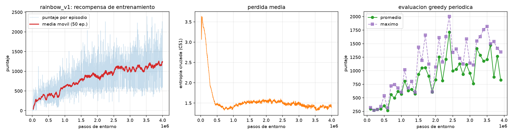

# Space Invaders — Agente de Reinforcement Learning

Proyecto 2 del curso CC3092 (Deep Learning y Sistemas Inteligentes, UVG).
Entrena un agente de RL capaz de jugar `ALE/SpaceInvaders-v5` y contiene todo el
pipeline: preprocesamiento del entorno, entrenamiento, evaluación con política
greedy, generación del video entregable y curvas de entrenamiento.

El repositorio parte del Laboratorio 5 (infraestructura de ALE y agentes
baseline aleatorio y de regla simple), que se conserva como punto de
comparación.

## El agente

**Rainbow-lite**: Double DQN + Dueling + replay priorizado + retornos de n pasos
+ NoisyNet + DQN distribucional (C51), implementado desde cero en PyTorch.

| Componente | Decisión | Justificación |
| --- | --- | --- |
| Algoritmo base | DQN | La recompensa de Space Invaders es dispersa y el espacio de acción discreto y pequeño (6); los métodos off-policy con replay aprovechan mucho mejor cada partida que un on-policy como PPO, que descarta la experiencia tras cada actualización. |
| Double DQN | Sí | El `max` de DQN estándar sobreestima los valores Q de forma sistemática; separar la selección (red online) de la evaluación (red objetivo) corta ese sesgo. |
| Dueling | Sí | En la mayoría de estados de Space Invaders conviene disparar sin importar mucho la acción exacta; separar V(s) de A(s,a) deja que la red aprenda el valor del estado sin estimar las 6 acciones por separado. |
| Distribucional (C51) | 51 átomos en [-10, 10] | Aprender la distribución del retorno en vez de su media da un gradiente mucho más informativo; es el ingrediente con mayor impacto individual en las ablaciones de Rainbow. |
| Replay priorizado | α = 0.5, β: 0.4 → 1.0 | Muestrea con más frecuencia las transiciones de mayor error TD (destruir la nave nodriza, morir), que son raras y las que más enseñan. |
| n-step | n = 3 | Propaga la recompensa hacia atrás 3 pasos por actualización en vez de 1, lo que acelera mucho el aprendizaje con recompensa dispersa. |
| Exploración | NoisyNet (σ₀ = 0.5), sin ε-greedy | El ruido vive en los pesos, así que el agente explora con estrategias coherentes durante un episodio en vez de dar pasos aleatorios sueltos, y la red puede reducir por sí sola la exploración donde ya domina. No hay calendario de ε que ajustar. |

### Arquitectura

Entrada `(4, 84, 84)` en `uint8`, normalizada a `[0,1]` dentro de la red.

```
Conv2d(4 -> 32, k=8, s=4) + ReLU      ->  (32, 20, 20)
Conv2d(32 -> 64, k=4, s=2) + ReLU     ->  (64,  9,  9)
Conv2d(64 -> 64, k=3, s=1) + ReLU     ->  (64,  7,  7)
Flatten                               ->  3136
   ├── NoisyLinear(3136 -> 512) + ReLU -> NoisyLinear(512 -> 51)        V(s)
   └── NoisyLinear(3136 -> 512) + ReLU -> NoisyLinear(512 -> 6*51)      A(s,a)
Q(s,a) = softmax( V + (A - media_a A) )     # distribución sobre 51 átomos
```

6.87 M parámetros. La torre convolucional es la de Mnih et al. (2015), que es la
que corresponde a una entrada de 84×84.

### Hiperparámetros

| Parámetro | Valor | Nota |
| --- | --- | --- |
| Optimizador | Adam, lr = 6.25e-5, eps = 1.5e-4 | El eps por defecto de PyTorch (1e-8) inestabiliza la pérdida distribucional. |
| Función de pérdida | Entropía cruzada entre distribución objetivo proyectada y predicha | Equivale a la KL; su valor por muestra es el error TD que alimenta PER. |
| Descuento γ | 0.99 | |
| Batch | 64 | En MPS el costo por paso lo domina el lanzamiento de kernels, no la aritmética: 64 muestras cuestan casi lo mismo que 32 (41.6 vs 43.9 pasos/s medidos). |
| Replay buffer | 300 000 transiciones | Con frames comprimidos ocupa ~2.1 GB; guardar las pilas completas serían ~17 GB. |
| Inicio del aprendizaje | 20 000 pasos | |
| Frecuencia de gradiente | cada 4 pasos de entorno | |
| Actualización de la red objetivo | cada 8 000 pasos | |
| Recorte de gradiente | norma 10 | |

## Estructura

```
src/
  config.py                   rutas, ids de entorno e hiperparámetros
  ale_utils.py                utilidades del Laboratorio 5 (crear_entorno, ejecutar_episodio, ...)
  wrappers.py                 cadena de preprocesamiento (entrenamiento y evaluación)
  modelos.py                  NoisyLinear y la CNN dueling distribucional
  replay.py                   árbol de sumas y replay priorizado con n-step
  agente.py                   agente Rainbow-lite: actuar, aprender, guardar/cargar
  01_generar_videos.py        etapa 1: baselines del laboratorio
  02_entrenar_dqn.py          etapa 2: entrenamiento
  03_evaluar_agente.py        etapa 3: evaluación greedy (config. de la competencia)
  04_generar_video_agente.py  etapa 4: video del agente entrenado
  05_graficar_curvas.py       etapa 5: curvas de entrenamiento
  run_pipeline.py             orquestador
notebooks/                    notebooks del laboratorio y del proyecto
modelos/                      checkpoints (.pt); se versiona solo el final
logs/                         CSV por episodio y por evaluación de cada iteración
entregables/
  videos/                     .mp4 de los agentes
  figuras/                    curvas de entrenamiento
  evaluacion.json             evaluación final del agente entrenado
  metricas.json               métricas de los baselines del laboratorio
codebook.md                   observaciones, acciones, recompensa y variables registradas
```

## Entorno de ejecución

macOS / Linux:

```bash
python3.11 -m venv .venv
source .venv/bin/activate
pip install -r requirements.txt
```

Windows (PowerShell):

```powershell
py -3.11 -m venv .venv
.venv\Scripts\Activate.ps1
pip install -r requirements.txt
```

Las ROMs de Atari vienen incluidas en `ale-py` desde la versión 0.10, por lo que
no hay que descargarlas aparte. El entrenamiento detecta automáticamente CUDA,
MPS (Apple Silicon) o CPU; se puede forzar con `--dispositivo`.

## Reproducir los resultados

### 1. Evaluar el modelo entregado (no requiere entrenar)

```bash
python src/03_evaluar_agente.py --modelo modelos/rainbow_space_invaders.pt
python src/04_generar_video_agente.py --modelo modelos/rainbow_space_invaders.pt
```

La primera corre los 5 episodios greedy de la competencia y escribe
`entregables/evaluacion.json`; la segunda graba los `.mp4` con exactamente la
misma configuración de entorno.

### 2. Entrenar desde cero

```bash
python src/02_entrenar_dqn.py --pasos 4000000 --etiqueta rainbow_v1
```

Cada paso de agente son 4 frames de emulación, así que 4 M pasos ≈ 16 M frames.
En un MacBook Pro M4 Pro (MPS) la corrida avanza a ~200 pasos/s, es decir unas
6 horas. El entrenamiento guarda un checkpoint cada 50 000 pasos y se puede
retomar con `--reanudar`; el replay buffer no se persiste (pesa gigabytes), así
que al reanudar se vuelve a llenar con la política ya aprendida.

### 3. Pipeline completo

```bash
python src/run_pipeline.py                 # evalúa, graba video y grafica curvas
python src/run_pipeline.py --entrenar      # incluye el entrenamiento
python src/run_pipeline.py --baselines     # regenera los videos del laboratorio 5
```

## Cargar los pesos del modelo final

El checkpoint guarda, además de los pesos, la configuración de preprocesamiento
con la que fue entrenado, de modo que no puede desalinearse con la evaluación:

```python
import sys; sys.path.insert(0, "src")
from agente import AgenteRainbow, elegir_dispositivo
from wrappers import crear_entorno_evaluacion

dispositivo = elegir_dispositivo()
agente = AgenteRainbow.cargar("modelos/rainbow_space_invaders.pt", dispositivo)
print(agente.preprocesamiento)   # frame skip, tamaño, apilado, sticky actions

env = crear_entorno_evaluacion()
obs, _ = env.reset(seed=2026)
accion = agente.actuar(obs, entrenando=False)   # entrenando=False => greedy, sin ruido
```

## Resultados

Corrida `rainbow_v1`: 4 000 000 pasos de agente (16 M frames) en un MacBook Pro
M4 Pro con MPS, ~7.5 h a 125 pasos/s.

### Evaluación final (configuración de la competencia)

5 episodios, política greedy, sin clipping de recompensa, semillas 2026–2030
(`entregables/evaluacion.json`):

| Episodio | Puntaje | Pasos | Video |
| --- | ---: | ---: | --- |
| 0 | 600 | 946 | `agente-entrenado-space-invaders-episode-0.mp4` |
| 1 | 1165 | 1439 | `agente-entrenado-space-invaders-episode-1.mp4` |
| 2 | 1655 | 2068 | `agente-entrenado-space-invaders-episode-2.mp4` |
| 3 | **1670** | 1957 | `agente-entrenado-space-invaders-episode-3.mp4` |
| 4 | 600 | 1075 | `agente-entrenado-space-invaders-episode-4.mp4` |

**Promedio 1138.0 · Máximo 1670 · Desviación 475.4**

Comparación con los baselines del Laboratorio 5: agente aleatorio 109,
agente de regla simple 391. El agente entrenado los supera por factores de
10.4x y 2.9x en promedio.

### Selección del checkpoint final

El checkpoint entregado NO es el del final del entrenamiento sino el del paso
2 400 000. La razón no es que aprenda mejor, sino cómo se mide la competencia:
se toma el **máximo** de 5 episodios, no el promedio. Evaluando ambos con 15
episodios (`entregables/eval15_*.json`) y estimando por bootstrap el máximo
esperado de 5:

| Checkpoint | Media | Desv. | E[máx de 5] | P(>1500) | P(>2000) |
| --- | ---: | ---: | ---: | ---: | ---: |
| Final, paso 4 000 000 | 1165 | 336 | 1547 | 78.8 % | 0.0 % |
| **Paso 2 400 000** | 1026 | **496** | **1642** | 67.3 % | **29.0 %** |

El checkpoint de 2.4 M tiene peor promedio pero una política más variable:
falla más seguido y acierta más alto. Bajo una métrica de máximo sobre 5
intentos esa cola larga vale más que la consistencia — el de 4 M nunca pasó de
2000 en 15 episodios, mientras que el de 2.4 M lo hace el 29 % de las veces.
Si la métrica fuera el promedio, la elección sería la contraria.

### Curvas de entrenamiento



Tres observaciones:

- La recompensa de entrenamiento **sigue subiendo a los 4 M pasos**, sin señal
  de meseta. El límite fue el tiempo de cómputo disponible, no la capacidad del
  agente.
- La pérdida C51 cae de 3.6 a ~1.45 en los primeros 500 k pasos y se mantiene
  estable el resto de la corrida: no hubo divergencia de los valores Q.
- La evaluación greedy periódica es muy ruidosa porque usa solo 3 episodios
  (rebota entre 573 y 1712). Esa varianza es del instrumento de medición, no
  del agente; la media móvil de 50 episodios de entrenamiento es la señal
  confiable.

### Iteraciones

| ID | Entorno de cómputo | Pasos | Cambios respecto a la anterior | Eval (promedio) | Eval (máximo) |
| --- | --- | ---: | --- | ---: | ---: |
| baseline-aleatorio | — | — | Política uniforme (Lab 5) | 109 | 215 |
| baseline-regla | — | — | Heurística de alineación por color (Lab 5) | 391 | 380 |
| rainbow_v1 | M4 Pro / MPS | 4 000 000 | Rainbow-lite completo | 1138 | 1670 |
| rainbow_colab | Colab T4 / CUDA | 3 096 268 | Misma configuración, otro hardware | 1171 | 1570 |

`rainbow_colab` se entrenó en paralelo para verificar que el resultado no
dependiera de una semilla o de un dispositivo afortunado: dos corridas
independientes en hardware distinto llegaron al mismo rango de puntaje.

## Baselines del Laboratorio 5

Episodios grabados con semillas 42, 43 y 44 (`entregables/metricas.json`):

| Agente | Video | Pasos sobrevividos | Recompensa total |
| --- | --- | ---: | ---: |
| Aleatorio | `aleatorio-space-invaders-episode-0.mp4` | 325 | 65 |
| Aleatorio | `aleatorio-space-invaders-episode-1.mp4` | 601 | 215 |
| Aleatorio | `aleatorio-space-invaders-episode-2.mp4` | 434 | 50 |
| Regla simple | `regla-simple-space-invaders-episode-0.mp4` | 1121 | 380 |

Sobre cinco episodios por agente, el aleatorio promedia 109.0 de recompensa y el
de regla simple 391.0. Las corridas son reproducibles: además de `reset(seed=...)`
se siembra `action_space.seed(...)`, que es el generador del que muestrea el
agente aleatorio.
